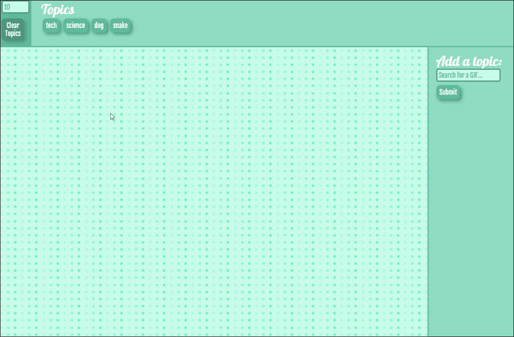
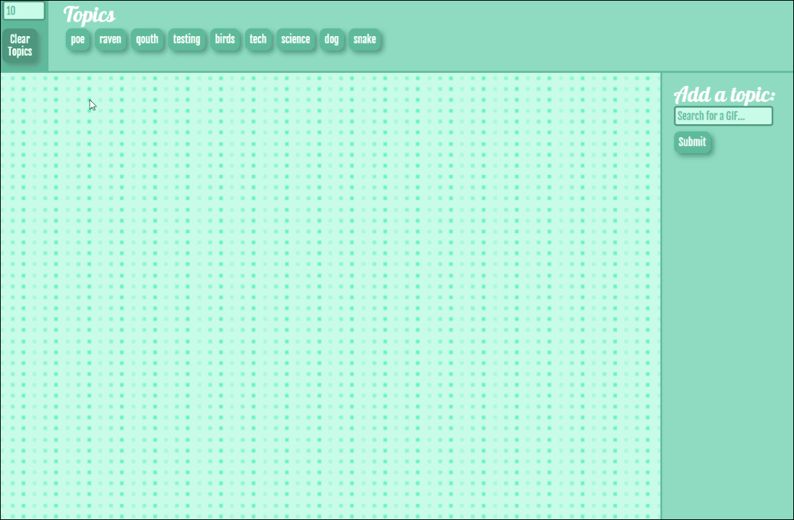

# GIF-Seach
### A site using the GIPHY API to find GIFs with a user defined topic
The site utilizes jQuery ajax queries to reach the API endpoint and retrieve the requested data in the form of a JSON.

GithubPages link can be found [here](https://james-ritchey.github.io/GIF-Seach/)

Users can click on a topic in the list to request GIFs related to that topic.  The site then populates with the number of 
GIFs the user requested, default is 10, and users can mouse over the images and the GIF will play.

Users can add topics to the list using the input to the right, as well as adjust the number of images they would like to request.

The topic list can also be cleared at any time.
